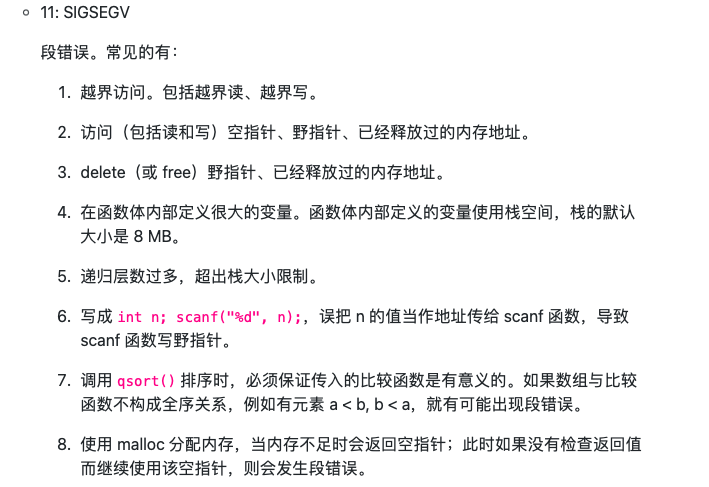
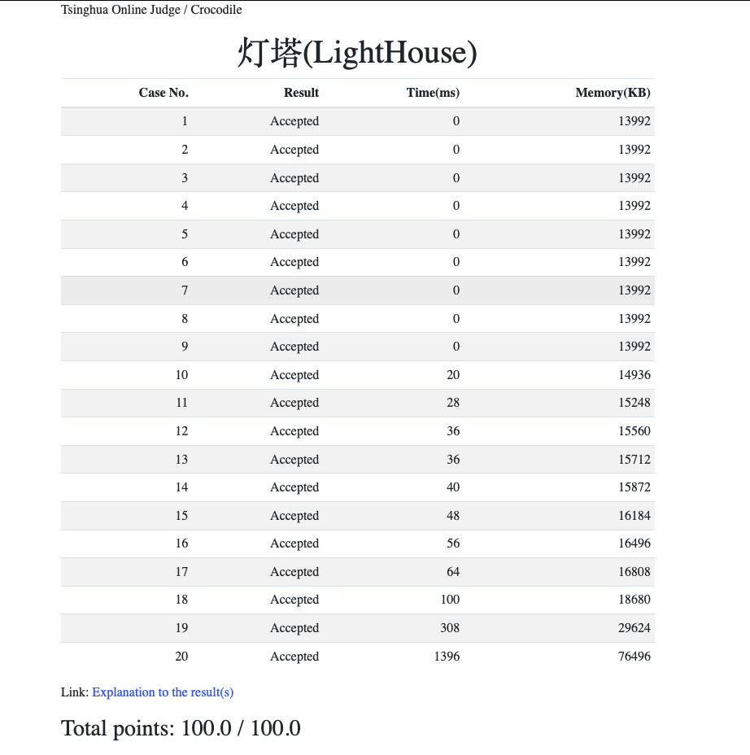

# LightHouse
## 题目大意
每个灯塔可以照亮位于其左下和右上的灯塔，给定坐标，找出能互相照亮的灯塔的对数，变相的逆序对。

## 思路

先根据其中一个坐标排序，然后根据另一个坐标找顺序对

## 问题

我是跟着邓老师的数据结构课程进度做的题，本想着用两次归并排序（因为快排还没学到），可分数一直卡在15分--（RunTime Error-signal 11-SIGSEGV），因为这个信号大多数情况下是由于指针越界的问题，让我一度以为是我归并排序写错了。
经过几个小时的无能挣扎，突然试了下网上大部分人套用的快排函数，一下就AC了😳
然后我再次阅读SIGSEGV信号的常见类型，发现了第4条和第5条。。。



<figure class="kg-card kg-image-card"></figure>

*   我自己的瞎猜想（有待进一步学习然后考证）
    若通过归并排序以x坐标为基准进行排序时，最大需要开辟一个单元个数为n，单元大小为8B（两个int）的数组，由题对90%的测试样例，n最大取3*10^5，这么算下来最小情况的这个最大的数组要占用2MB以上，再加上归并排序的递归深度相对于快速排序也不小，所以可能就超出了函数内栈内存8MB的限制hhh
    而快速排序的空间复杂度是O(logn)，比归并排序的O(n)小不少
    或许就是这个原因吧，我目前的知识储量也就这了🙃

## AC代码

先附上AC截屏，艾玛，太不容易了，主要是不给测试数据，就跟无头苍蝇乱撞一样，纪念一下



```cpp linenums="1"
#include <iostream>
#include <cstdlib>
#include <cstdio>
using namespace std;

struct LightHouse
{
    int x, y;
}*lhs;

void invBetween(int *y, int l, int mid, int r,long long &cnt)
{
    int la = mid - l;
    int lb = r - mid;
    int *A = new int[la];
    for(int i = 0, j = l; i < la; A[i++] = y[j++]);
    int *B = y + mid;
    for(int i = 0, j = 0, k = l; i < la;)
    {
        if(j >= lb '' A[i] < B[j])
        {
            y[k++] = A[i++];
            // 顺序对
            if(j < lb)
                cnt += (long long)(lb-j);
        }
        if(j < lb && A[i] > B[j])
            y[k++] = B[j++];
    }
    //归并排序核心部分的另种写法，我还怀疑过写法的问题🤣
    // int i = 0, j = 0, k = l;
    // while(i < la)
    // {
    //     if(j < lb && B[j] < A[i])
    //     {
    //         y[k++] = B[j++];
    //           // 逆序对
    //         cnt += (long long)(la - i);
    //     }
    //     else
    //         y[k++] = A[i++];
    // }
    delete []A;
}

void invInside(int *y, int l, int r,long long &cnt)
{
    if(r - l < 2)
        return;
    int mid = (l + r) / 2;
    invInside(y, l, mid, cnt);
    invInside(y, mid, r, cnt);
    invBetween(y, l, mid, r, cnt);
}

//下面两个函数用了qsort()后就没用了
void merge(int l, int mid, int r)
{
    int la = mid - l;
    int lb = r - mid;
    LightHouse *A = new LightHouse[la];
    for(int i = 0, j = l; i < lb; A[i++] = lhs[j++]);
    LightHouse *B = lhs + mid;
    int i = 0, j = 0, k = l;
    while(i < la)
    {
        if(j < lb && B[j].x < A[i].x)
            lhs[k++] = B[j++];
        else
            lhs[k++] = A[i++];
    }
    delete []A;
}
void mergeSort(int l, int r)
{
    if(r - l < 2)
        return;
    int mid = (1 + r) / 2;
    mergeSort(l, mid);
    mergeSort(mid, r);
    merge(l, mid, r);

}

//void*型指针的一种用法
int cmp(const void *v1, const void *v2)
{
    return ((LightHouse*)v1)->x -((LightHouse*)v2)->x;
}
int main()
{
    int n; // the number of lighthouse
    scanf("%d", &n);
    lhs = new LightHouse[n];
    for(int i = 0; i < n; ++i)
        scanf("%d %d", &lhs[i].x, &lhs[i].y);
    // 题目提示可能超出int表示范围，所以用long long
    long long cnt = 0; // the number of sequence

    qsort(lhs, n, sizeof(LightHouse), cmp);
    // mergeSort(0, n); // sort based on x
    int *y = new int[n];
    for(int i = 0; i < n; ++i)
        y[i] = lhs[i].y;
    invInside(y, 0, n, cnt); // compute cnt based on y 

    // 两种计算方式，第一个是算出逆序对然后C(n,2)减一下，第二个是直接算出顺序对
    // printf("%lld", (long long)(n)*(long long)(n-1)/(long long)(2) - cnt);
    printf("%lld", cnt);
    delete []lhs;
    delete []y;
    return 0;
}
```

